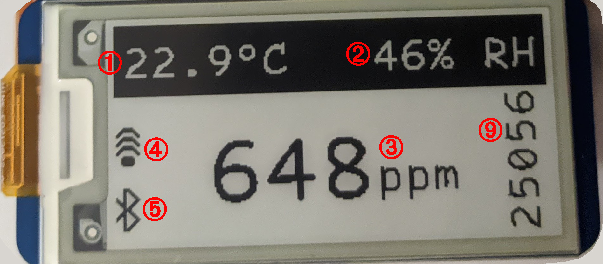

### warning

Be warned! This design is currently still evolving, and parts may be swapped around or added in the future.

### parts

dev boards:

- esp32 dev board, any will do, but ideally go for one with 38 pins. [berrybase link](https://www.berrybase.de/esp32-nodemcu-development-board).
- scd41 (co2 sensor). personally I've used the seeed studios breakout board. [berrybase link](https://www.berrybase.de/seeed-grove-co2-temperature-feuchtigkeits-sensor-scd41), [seeedstudio link](https://www.seeedstudio.com/Grove-CO2-Temperature-Humidity-Sensor-SCD41-p-5025.html). [adafruit's one will do too](https://www.adafruit.com/product/5190).
- Optional: bmp180 (pressure sensor). I don't like this sensor and I'll swap it later. If this is not found on the i2c chain it will automatically be disabled. [berrybase link](https://www.berrybase.de/bmp180-temperatur/luftdrucksensor-shield-fuer-d1-mini), [direnc.net link](https://www.direnc.net/bmp180-dijital-barometrik-sensor)
- Optional: waveshare 2.13in 250x122 e-ink display, not the raw display, but one with a built-in driver board. I've personally used the raspberry pi hat. Screen can be disabled in config. [waveshare link](https://www.waveshare.com/product/2.13inch-e-paper-hat.htm)

also, of course:

- 10k resistors. You'll use up to half a dozen of them. Get a size you're comfortable soldering.
- Optional, but useful: Capacitors, 10uF, ceramic, etc. I used one that was `10uF 25VDC 10% X7R 1210 SMD`.
- Optional: If you want a switch for bluetooth or wifi, get small latching switches (SPDT).

### example wiring

note: not all GPIOs are usable on an esp32, as some are https://randomnerdtutorials.com/esp32-pinout-reference-gpios/

```
G27 -> SCD41 SCL (yellow)
G26 -> SCD41 SDA (white)
SCD41 SCL -> BMP180 SCL (yellow)
SCD41 SDA -> BMP180 SDA (white)
G33 -> wifi switch middle (brown)
G25 -> bt switch middle (blue)
G16 -> red LED (gray)

G23 -> screen DIN/MOSI (yellow)
G18 -> screen CLK/SCK (blue)
G19 -> screen CS (gray)
G21 -> screen DC (brown)
G22 -> screen BUSY (yellow)
G15 -> nothing (needed for nonexistent screen miso)

GND -> SCD41 GND (black)
GND -> wifi switch bottom (10k + black)
GND -> bt switch bottom (black)
GND -> screen GND (black)
GND -> red LED (resistor + black)

3V3 -> SCD41 PWR (red)
3V3 -> wifi switch top (10k + red)
3V3 -> bt switch top (10k)
3V3 -> screen VCC (red)

Nothing -> screen RST
```

More to come!

### installing stuff

- install latest stable micropython on your esp32
- install the libraries in [esp32/requirements.txt](esp32/requirements.txt), [see this link](https://docs.micropython.org/en/latest/reference/packages.html).
- manually apply the following changes to the ble library you've installed https://github.com/micropython/micropython-lib/pull/629 (if it is not yet merged).
- copy `esp32/config.json.template` to `esp32/config.json` and configure it to your liking.
- copy the files across:

```bash
pip3 install adafruit-ampy
cd esp32
ampy -p /dev/ttyUSB0 put main.py
ampy -p /dev/ttyUSB0 put config.json
ampy -p /dev/ttyUSB0 put helpers.py
ampy -p /dev/ttyUSB0 put influx_helpers.py
ampy -p /dev/ttyUSB0 put bmp180.py
ampy -p /dev/ttyUSB0 put bmp280.py
ampy -p /dev/ttyUSB0 put scd41.py
ampy -p /dev/ttyUSB0 put comic_code_24.py
ampy -p /dev/ttyUSB0 put comic_code_24.bin
ampy -p /dev/ttyUSB0 put comic_code_48.py
ampy -p /dev/ttyUSB0 put comic_code_48.bin
ampy -p /dev/ttyUSB0 put waveshare213.py
ampy -p /dev/ttyUSB0 put web_server.py
ampy -p /dev/ttyUSB0 put waveshare_lut_full_update.bin
ampy -p /dev/ttyUSB0 mkdir lib
ampy -p /dev/ttyUSB0 mkdir logs
```

then merely boot your board and watch it upload/broadcast/display your sensor values :)

### parsing the screen



(1) Temp data from SCD41. Defaults to Celsius. Currently no way to change it to Fahrenheit.<br>
(2) Relative Humidity data from SCD41.<br>
(3) CO2 PPM data from SCD41.<br>
(4) WLAN status indicator.<br>
(5) Bluetooth status indicator.<br>
(9) Baka display (free memory on the system. useful for watching for memory leaks. only shown if `config["screen"]["debug"]` is true).

### fetching logs (if local logging is enabled)

```bash
ampy -p /dev/ttyUSB0 get logs/rh.log rh.log
ampy -p /dev/ttyUSB0 get logs/c.log c.log
ampy -p /dev/ttyUSB0 get logs/pressure.log pressure.log
ampy -p /dev/ttyUSB0 get logs/co2.log co2.log
ampy -p /dev/ttyUSB0 rm logs/rh.log
ampy -p /dev/ttyUSB0 rm logs/c.log
ampy -p /dev/ttyUSB0 rm logs/pressure.log
ampy -p /dev/ttyUSB0 rm logs/co2.log
```

can be viewed with `tools/logparser.py`: `python3 logparser.py /tmp/co2.log`
