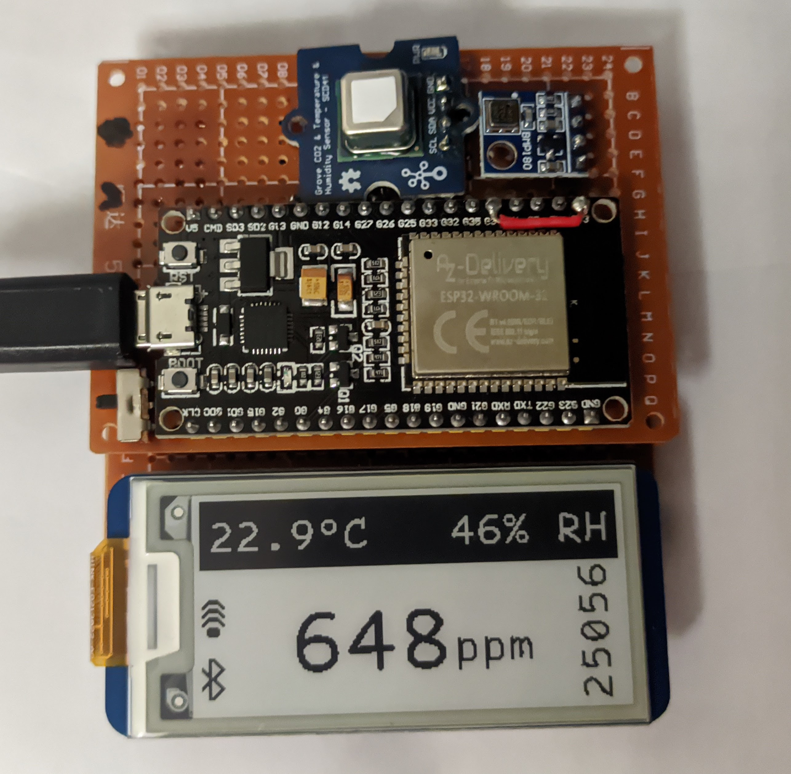

## avenet42

An attempt to make a full-featured (similar to aranet4) while also being a bit more budget friendly.

### features

- wifi: can upload data points to influxdb over wifi.
- bluetooth: can fetch data over bluetooth. a simple web ui using webbluetooth is available, see `web/` for more info.
- screen: supports grayscale waveshare e-ink displays (tested with 1.33in v2).
- local logging: optionally, the sensor data can be stored on flash to be fetched later, for example to save pressure data during a flight.

### building your own

See [BUILDING.md](BUILDING.md) for wiring and flashing instructions. I'll design a PCB eventually.

### general TODOs (will be moved to issues eventually)

- helper_convertfont: make an adj tool to generate text images from font files
- hw: battery
- hw: case
- web: service workers for UI to work offline
- web: better UI
- web: cleaner code
- web: account for losing focus
- web: fix disconnect button
- web: complex comms to read config
- micropython: complex comms to read config
